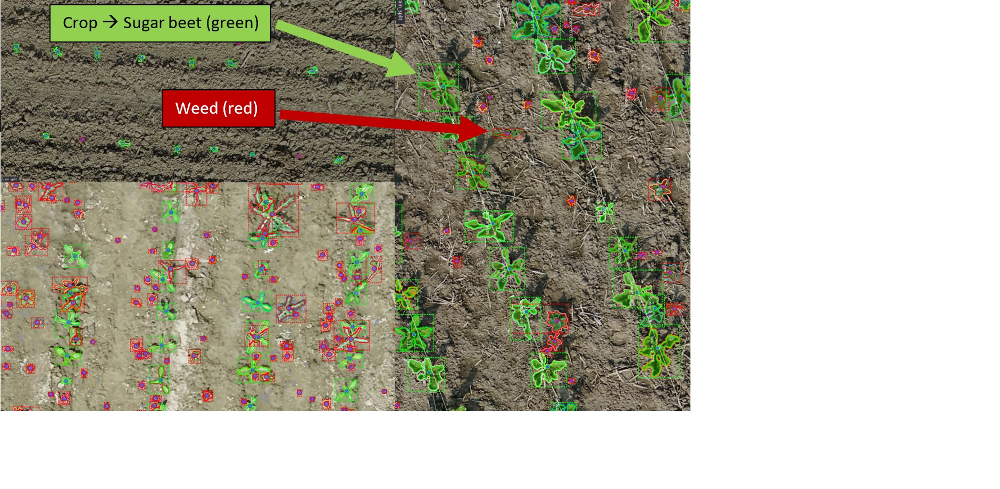
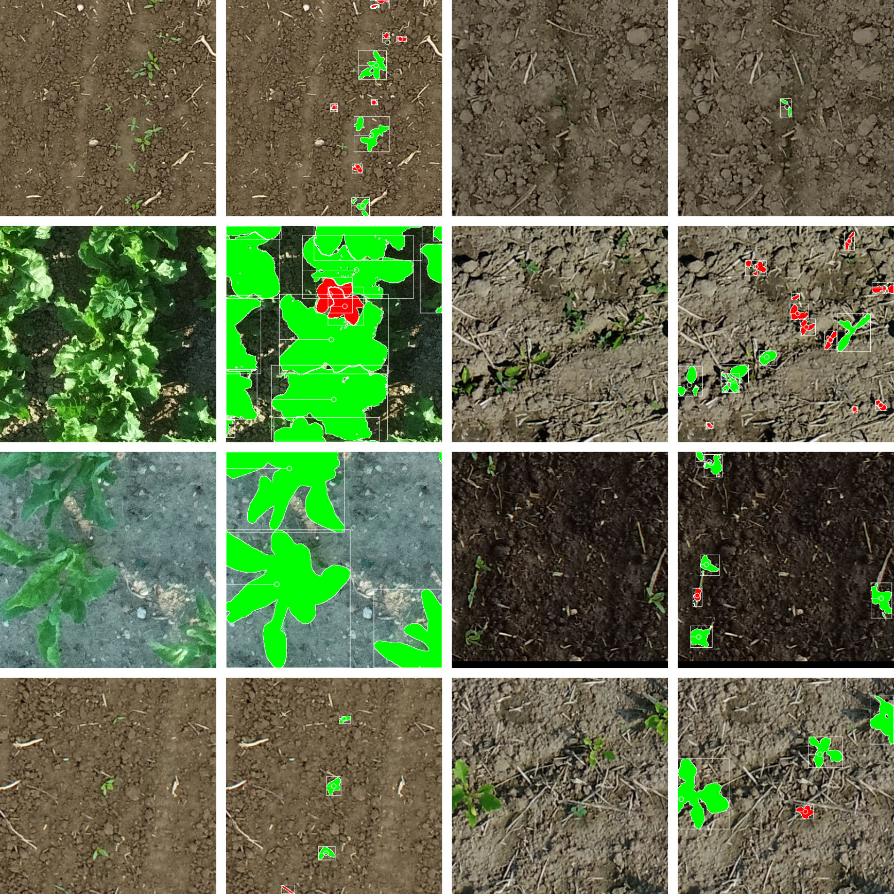

# Coding Challenge

### Introduction

The goal of the programming assignment is to evaluate your ability to work with standard computer vision libraries and machine learning frameworks to develop, deploy, and assess a multi-class object recognition model.

The result of this programming task is an executable Python program that

* loads your developed object recognition model,
* does preditions for some images from a given dataset, and
* calculates a simple performance metric for the evaluation of your model.

Typical metrics are the IoU over the bounding boxes as well as the F1 score over the predicted class labels.

We provide you with a dataset and a parser model, which reads in the dataset – so you can focus on both model design and evaluation of your model.

Our goal is not to find the one that gives us the highest performance! We want to see how you approach the problem and if you can familiarize yourself with a new problem in a comparably short period. This is our daily work routine. Additionally, we want to see how you write code, of course.

### Dataset

The dataset we provide consists of high-resolution RGB images of plants, more specifically sugar beets and weeds. The images were taken with different drones, in different fields, and at different times.



The figure illustrates the data and the way they are annotated. There are two object classes, sugar beets (in green) and the weeds (in red). The soil or other objects implicitly belong to the background class. Each plant in the data is annotated as an instance, i.e., information about bounding box, semantic mask, stem key point (mostly center of mass of semantic mask), and semantic label (sugarbeet or weed). 

The dataset contains plants of different growing stages. Sometimes the plants are well separated, and sometimes they overlap within one class or with the other class.

We do not provide any train, validation, or test splits of the dataset. It's up to you to deal with the data and how you prefer to set up partitions or other modifications to building a model for the task.

Here's the download link:

[TODO](TODO)

Here's another impression of the variety of the data:



#### Data Parser

There is an existing parser for the dataset. For a usage example, see [here](examples/parser.py). The parser implements `__getitem__` and `__len__`, like PyTorch's [map-style dataset](https://pytorch.org/docs/stable/data.html#map-style-datasets) (but you are not required to use PyTorch).

It's tested with Python 3.8.2. The following additional packages are needed (different versions should usually work as well):

```
Numpy 1.20.3
OpenCV 4.5.3
PyYaml 5.4.1
Rtree 0.9.7 (spatial index library)
```

We usually don't work with fixed-size images but sample subregions from larger maps that do not necessarily fit into the GPU memory.  This is also what happens inside the parser.  So please forgive us if the parser is slightly slower from what you are used to from fixed-size images. There are some options to control the sampling behaviour (again see the [usage example](examples/parser.py)). For further details, have a look at the [code](src/pidata/pidata/pi_parser.py). Important functions should be documented.

The parser requires two packages (`pidata` and `piutils`) that can be found in the `src` folder. Both should be visible to your python interpreter. One option is to just add the following lines to the `.bashrc` in your home directory (given you are are a Linux user using bash):

```
export PI_SRC_PATH="TODO/coding_task_make-a-model/src"
export PYTHONPATH="${PYTHONPATH}:${PI_SRC_PATH}/piutils"
export PYTHONPATH="${PYTHONPATH}:${PI_SRC_PATH}/pidata"
```

The code within this repository is licensed under MIT. So in case you decide against us, you can still take everything written for this challenge and put it to use somewhere else :)

### Getting Started

We suggest you start by creating a fork of this repository, then have a look at the [parser example](examples/parser.py). Depending on your bandwidth, you may want to start downloading the dataset  (~1 GB) before.

### Submission

Please create a ZIP file of the repository you working and upload it to HIDRIVE (you should have received a link from us). Then send a note to philipp.lottes@phenoinspect and jan.quakernack@phenoinspect.de to your repository. The repository should contain a README with instructions how to set up and use your software. Larger files (e.g. network weights) you want to share can also be uploaded to HIDRIVE (you should have received a link from us). In that case, please also put a Link in the README.

Remember, your code should

* load you model,
* do predictions for some images (either for a split of the provided dataset or a different dataset in the same format), and
* compute some simple performance metrics.

The goal for you model is to detect plants of different classes. Your model might output

* a list of detected objects' location and size, e.g. a bounding box,
* the assigned class label of each plant instance,
* a pixel-wise mask of each plant instance, and/or
* other things, such as the stem keypoint position, a scalar size estimate, or a confidence score.

Please visualize the model predictions in a human-friendly way. You can use [this module](src/piutils/piutils/pi_drawing.py) to do so.

Please don't push the hardware requirements for deployment too far. A Nvidia GeForce 2080 (~12 GB) should be sufficient to deploy your model.

You can use existing software to solve the task but please keep it separated from your own code and respect the copyright of others. Also, your submission should contain a dedicated piece of code that you wrote entirely by your own to address the challenge. It should be something you consider giving a good impression of your coding capabilities. Examples may be
* a module for data augmentation (note that some basic options are provided by the parser),
* a special loss function,
* an evaluation module, or
* a special visualization that helps to understand the model/dataset better.

**Please state explicitly in the README where in the repository we'll be able to find this piece of code.**

### Our Expectation

Your submission and the follow-up discussion should demonstrate that:

* You know your tools and can set up a machine learning pipeline fast. To do so, you're able to use third-party tools while keeping external code well separated from your own. Also, you always have a clear picture of the dependencies of your software. Keep in mind that we are eager to see one piece of software, e.g. one module, with some substantial functionality written entirely by your own.

* You write clean, working and largely self-documenting code.

* You can organize the data at hand and make plausible why the performance metrics you measured are relevant for the test case.

* You think beyond the current state of the projects and have ideas how to improve it further.

* You do not hesitate to contact us if there are questions regarding the task, the data, the code or anything else we have in our hands that keeps you from taking part in the challenge. Also, if it's errors in our code. In that case, please write to jan.quakernack@phenoinspect.de.

The dataset is an actual challenging one. We do not expect perfect results, but are curious to see how you tackle the problem.

We hope you enjoy the challenge!

### License and Software Information

© Pheno-Inspect GmbH

Pheno-Inspect GmbH publishes this software and accompanied documentation (if any) subject to the terms of the MIT license with the aim of opening some challenge wordings to the community. You will find a copy of the MIT license in the root folder of this package. All rights not explicitly granted to you under the MIT license remain the sole and exclusive property of Pheno-Inspect GmbH.

NOTICE: The software has been designed solely for the purpose of analyzing the code quality by checking the coding guidelines. The software is NOT designed, tested or verified for productive use whatsoever, nor or for any use in real applications.

If you want to contact Pheno-Inspect GmbH regarding the software, you can mail us at info@phenoinspect.de.